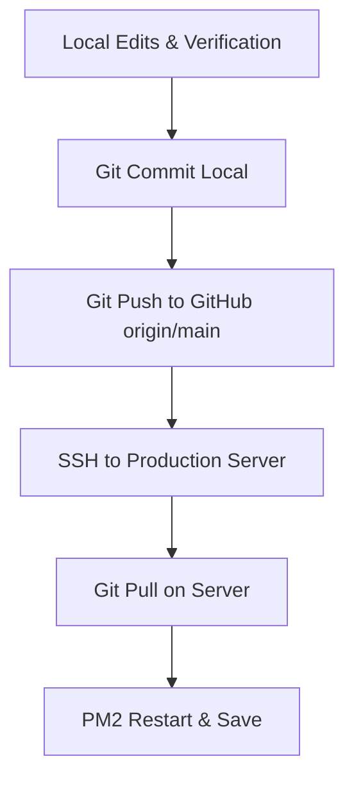

# AETHER // Deployment & Workflow Guide

This document defines the official deployment workflow and repository architecture for the Aether landing page project. To prevent conflicts and maintain a single source of truth, follow these guidelines.

---

## 🎯 Repository & Directory Architecture

1. **Official Source of Truth (GitHub)**:
   - **Repository URL**: `https://github.com/ecoartic/xyz1.git`
   - **Branch**: `main`

2. **Local Development Workspace**:
   - **Primary Directory**: `c:\Users\ecoartic\Downloads\note`
   - **Backup/Secondary Directory**: `D:\antigravity projects\xyz` (Sync matches local edits)

3. **Production Server environment**:
   - **Directory Path**: `/root/xyz1`
   - **PM2 Process Name**: `aether-site`

---

## 🔄 Step-by-Step Deployment Workflow

Always develop and test changes locally. Never modify files directly on the production server.



### 1. Local Development & Verification
- Perform edits using Antigravity or your local IDE.
- Verify changes by running the local server (`http://localhost:8082/` and `/admin.html`).

### 2. Commit & Push Changes
Stage and push your changes to the primary repository:
```bash
# Add modifications
git add .

# Create descriptive commit
git commit -m "feat/fix: descriptive change message"

# Push to primary origin
git push origin main
```

### 3. Apply Update on Production Server

> [!WARNING]
> **One-Time Migration Step**: Before pulling the untracked file updates (`config.json`, `mp_.mp4`, `video_note.mp4`), perform the following commands on the server to prevent Git from deleting existing production assets:
> ```bash
> cd /root/xyz1
> mkdir -p uploads
> cp mp_.mp4 uploads/mp_.mp4
> cp video_note.mp4 uploads/video_note.mp4
> cp config.json config.production.backup.json
> ```

SSH into your production server and pull the updates:
```bash
# Navigate to production directory
cd /root/xyz1

# Pull newest commits
git pull origin main

# Verify files post-pull
ls -lh uploads/
ls -lh config.json

# If config.json was deleted by the pull, restore it:
if [ ! -f config.json ] && [ -f config.production.backup.json ]; then
    cp config.production.backup.json config.json
fi

# Restart the application runner with env variables
ADMIN_USER="Admin" ADMIN_PASSWORD="your-strong-password" pm2 restart aether-site --update-env

# Save current PM2 process list configuration
pm2 save
```

---

## 🔒 Security Configuration Reference

- **Admin Authentication**: Uses standard HTTP Basic Authentication.
  - **Username**: Configured via `ADMIN_USER` env variable (Default: `Admin`).
  - **Password**: Configured via `ADMIN_PASSWORD` env variable (Default: `Eco1360724@`).
- **CSP (Content-Security-Policy)**:
  - Controlled via environment variable `ALLOW_UNSAFE_EVAL` (default `false`).
  - Toggle to `true` if dynamic runtime scripts require execution:
    ```bash
    ALLOW_UNSAFE_EVAL=true pm2 restart aether-site
    ```
